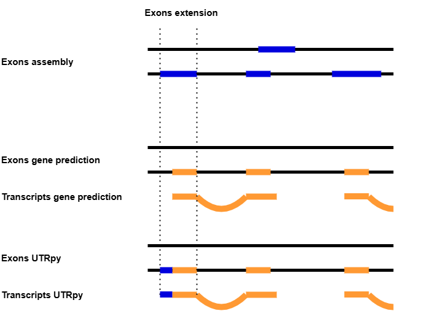

<p align="center">
  
</p>

<p align="center">
  
  <br>
  <em>UTRpy workflow</em>
</p>

UTR extension of transcript exons from protein orthology based gene prediction using exons from reference based assembly.

Protein ortholog-based gene prediction enables the transfer of detailed gene structure and functional annotations across species by leveraging evolutionary conservation. Genome annotations from such methods, however, usually lack Un-Translated Regions (UTRs). UTRpy supplements these by using exons from reference based transcriptome assemblies.

The decision if in a pair of exons the exon from the transcriptome assembly (exon_ta) is<br>
an UTR-extension for the exon from the gene prediction (exon_gp) is based on the following criteria:
1. The length of exon_ta does not exceed a certain limit
2. Their strand information must match (More details in the Parameters section)
3. Exon_ta and exon_gp have either shared start or end positions
4. Exon_ta actually extends tran_gp to one side

## Installation

Tested with Python 3.12.8, but any Python >= 3.10 should be fine too.

```
git clone https://github.com/SimonHegele/UTRpy
cd UTRpy
pip install .
```

## Usage

```
usage: utrpy [-h] [-max MAXIMUM_EXON_LENGTH] [-t THREADS] [-s] gff_prediction gff_assembly gff_utrpy

UTR extension of transcript exons from protein orthology based gene prediction using exons from reference based assembly

positional arguments:
  gff_prediction        GFF-format genome annotation from gene prediction.
  gff_assembly          GFF-format genome annotation from transcriptome assembly.
  gff_utrpy             Output file path

options:
  -h, --help            show this help message and exit
  -max MAXIMUM_EXON_LENGTH, --maximum_exon_length MAXIMUM_EXON_LENGTH
                        Maximum exon length prevents the use of unreasonably long exons. [Default:20000]
  -t THREADS, --threads THREADS
                        Number of threads to use [Default:4]
  -s, --strict_strandedness
                        If True: Exons with unknown strandedness are not used [Default:False]
```

### Parameters

- **Input**<br>
Annotations from gene prediction and transcriptome assembly.<br>
The gene prediction annotation must be in GFF-format while the transcriptome assembly can be either in GFF-format or GTF-format.
- **maximum_exon_length**<br>
Exons from the transcriptome assembly exceeding this length are considered to be incorrect and are not used.<br>
Default: 20000
- **strict_strandedness**<br>
If True, only exons from the transcriptome assembly known to be on the same strand are used.
Else, all exons from the transcriptome assembly that are not known to be of a different strand are used.
Default: False

### Output

The gene prediction gff with extended Exons:

Exons:<br>
1	seqid	<seqid_transcriptome_assembly> (same as <seqid_gene_prediction>)<br>
2	source  <source_gene_prediction> + <source_transcriptome_assembly> (UTRpy)<br>
3	type	exon<br>
4	start	<start_transcriptome_assembly><br>
5	end	<end_transcriptome_assembly><br>
6	score	<score_transcriptome_assembly><br>
7	strand <strand_transcriptome_assembly> (same as <strand_transcriptome_assembly> if conservative=True)<br>
8	phase	.<br>
9	attributes  <attributes_gene_prediction><br>

Transcripts<br>
Start and end positions updated according to the exon extension

Genes<br>
Start and end positions updated according to the exon extension

**Example:**

Gene prediction input exon:     
`Chr_1 AUGUSTUS    exon    2207399   2208325   .   -   .   ID=agat-exon-51;Parent=ga_chond_ext_ncbi_g49.t1;gene_id=g_p_13;transcript_id=ga_chond_ext_ncbi_g49.t1`

Transcriptome assembly input exon:     
`Chr_1  StringTie   exon    2206428 2208325 1000.0  -   .   transcript_id "STRG.130.1"; gene_id "STRG.130";`

UTRpy output exon:    
`Chr_1 AUGUSTUS + StringTie (UTRpy)    exon    2206428   2208325 1000.0  -   .   ID=agat-exon-51;Parent=ga_chond_ext_ncbi_g49.t1;gene_id=g_p_13;transcript_id=ga_chond_ext_ncbi_g49.t1`

## Future plans

1. Explicitly adding UTRs as features to the resulting annotation
2. Switching from Pandas to the faster Polars
