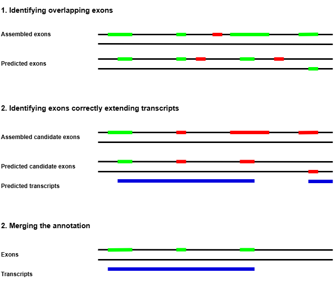

# UTRpy

Extending transcripts in genome annotations from protein orthology based gene prediction<br>
tools using exons in genome annotations from reference based transcriptome assembly tools.

<p align="center">
  
  <br>
  <em>UTRpy workflow</em>
</p>

Given an exon from the transcriptome assembly (exon_ta) and an exon from the genome<br>
prediction (exon_gp) and its corresponding transcript (tran_gp) we decide if exon_ta is a<br>
suitable replacement for exon_gp based on following criteria:
1. The length of exon_ta does not exceed a certain limit
2. Their strand information must match (More details in the Parameters-section)
3. Exon_ta and exon_gp have either shared start or end positions
4. Exon_ta actually extends tran_gp

## Installation

```
git clone https://github.com/SimonHegele/UTRpy
cd UTRpy
pip install .
```

## Usage

```
usage: utrpy [-h] [-mel MAXIMUM_EXON_LENGTH] [-meo MINIMUM_EXON_OVERLAP] [-t THREADS] [-c] gff_prediction gff_assembly gff_utrpy

Genome annotions from protein orthology based gene prediction tools lack UTRs. Exons in these kind of gene annotations can be extended toalso cover UTRs using exons generated with reference based assembly tools
such as StringTie.

positional arguments:
  gff_prediction        GFF-format genome annotation from gene prediction.
  gff_assembly          GFF-format genome annotation from transcriptome assembly.
  gff_utrpy             Output file path

options:
  -h, --help            show this help message and exit
  -mel MAXIMUM_EXON_LENGTH, --maximum_exon_length MAXIMUM_EXON_LENGTH
                        Maximum exon length prevents the use of unreasonably long exons. [Default:25000]
  -meo MINIMUM_EXON_OVERLAP, --minimum_exon_overlap MINIMUM_EXON_OVERLAP
                        Minimum overlap of exons to be considered [Default:3]
  -t THREADS, --threads THREADS
                        Number of threads to use [Default:4]
  -c, --conservative    Will not use exons if their strand is not known [Default:True]
```

### Parameters

1. **maximum_exon_length**
To my best knowlege the longest confirmed exon is of the MUC16 gene and has a length of<br>
~21kb (https://doi.org/10.1093/nar/gks652). One might therefore pose a limit on the exon<br>
lengths to prevent the use of falsely assembled transcripts.
2. **minimum_exon_overlap**<br>
Minimum overlap length of pairs of exons to be further investigated. Increasing the value<br>
increases speed at the cost of sensitivity.
3. **conservative**<br>
If True (default), exons from the gene prediction are only replaced with exons from the<br>
transcriptome assembly if they are known to be of the same strand.<br>
If False it is sufficient if they are not known to be of different strands (The strand of<br>
one or both of them might not be known).

### Output

Gene prediction input exon:     
`HiC_scaffold_1 AUGUSTUS    exon    2207399   2208325   .   -   .   ID=agat-exon-51;Parent=ga_chond_ext_ncbi_g49.t1;gene_id=g_p_13;transcript_id=ga_chond_ext_ncbi_g49.t1`

Transcriptome assembly input exoon:     
`HiC_scaffold_1  StringTie   exon    2206428 2208325 1000.0  -   .   transcript_id "STRG.130.1"; gene_id "STRG.130";`

UTRpy output exon:    
`HiC_scaffold_1 AUGUSTUS + StringTie (UTRpy)    exon    2206428   2208325 1000.0  -   .   ID=agat-exon-51;Parent=ga_chond_ext_ncbi_g49.t1;gene_id=g_p_13;transcript_id=ga_chond_ext_ncbi_g49.t1`

For exons the attributes of the genome prediction exons are kept and the source updated to <source_gene_prediction> + <source_transcriptome_assembly> (UTRpy). All other fields are used from the transcriptome assembly exons.

For transcripts and genes the start / end positions are updated according to the extension.
