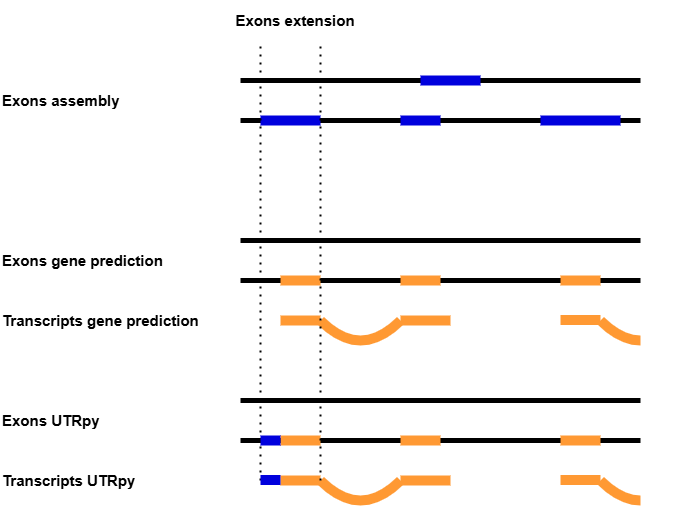
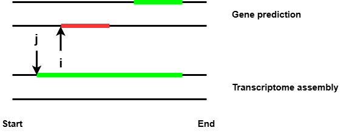

<p align="center">
  
</p>

<p align="center">
  
</p>

Lost in translation but meaningfull: UnTranslated Regions (UTRs), have a variety of important regulatory functions and a genome annotation without them wouldn't really be complete, right?

Protein ortholog-based gene prediction enables the transfer of detailed gene structure and functional annotations across species by leveraging evolutionary conservation. However, genome annotations from such methods lack UTRs. UTRpy supplements these by using exons from reference based transcriptome assemblies.

The decision if in a pair of exons the exon from the transcriptome assembly (exon_ta) is<br>
an UTR-extension for the exon from the gene prediction (exon_gp) and its corresponding transcript (tran_gp) is based on the following criteria:
1. The length of exon_ta does not exceed a certain limit
2. Their strand information must match (More details in the Parameters section)
3. Exon_ta and exon_gp have either shared start or end positions
4. Exon_ta actually extends tran_gp to one side

## 1 Installation

Tested with Python 3.12.8, but any Python >= 3.10 should be fine too.

```
git clone https://github.com/SimonHegele/UTRpy
cd UTRpy
pip install .
```

## 2 Usage

```
usage: utrpy [-h] [-max MAXIMUM_EXON_LENGTH] [-t THREADS] [-s] [-e] gff_prediction gff_assembly gff_utrpy

UTR extension of transcript exons from protein orthology based gene prediction using exons from reference based assembly

positional arguments:
  gff_prediction        GFF-format genome annotation from gene prediction.
  gff_assembly          GFF-format genome annotation from transcriptome assembly.
  gff_utrpy             Output file path

options:
  -h, --help            show this help message and exit
  -max MAXIMUM_EXON_LENGTH, --maximum_exon_length MAXIMUM_EXON_LENGTH
                        Maximum exon length prevents the use of unreasonably long exons. [Default:20000]
  -t THREADS, --threads THREADS
                        Number of threads to use [Default:4]
  -s, --strict_strandedness
                        Exons with unknown strandedness are not used
  -e, --explicit        Explicitly add UTRs as features
```

### 2.1 Parameters

- **Input**<br>
Annotations from gene prediction and transcriptome assembly.<br>
The gene prediction annotation must be in GFF-format while the transcriptome assembly can be either in GFF-format or GTF-format.<br> 
- **maximum_exon_length**<br>
Exons from the transcriptome assembly exceeding this length are considered to be incorrect and are not used.<br>
Default: 20000
- **strict_strandedness**<br>
Only use exons from the transcriptome assembly known to be on the same strand<br>
Otherwise, exons of unknown strands are allowed.
- **explicit**<br>
Explicitly add 5'-UTRs and 3'UTRs as features to the output GFF.
Hint: By using the dummy.gff-file you can use this feature without providing additional exons. 

### 2.2 Output

For Exons with UTR-extension start and end positions of the exons themselves as well as for their transcripts and genes are updated and their source set to <source_gene_prediction> + <source_transcriptome_assembly> (UTRpy)

If run with the "-e"/"--explicit" you can use the provided Jupyter-notebook to take a look on the length distributions of the UTRs.

In the output GFF any comments from the original GFF are removed.

**Example:**

Gene prediction input exon:     
`Chr_1 AUGUSTUS    exon    2207399   2208325   .   -   .   ID=agat-exon-51;Parent=ga_chond_ext_ncbi_g49.t1`

Transcriptome assembly input exon:     
`Chr_1  StringTie   exon    2206428 2208325 1000.0  -   .   transcript_id "STRG.130.1"; gene_id "STRG.130";`

UTRpy output exon:    
`Chr_1 AUGUSTUS + StringTie (UTRpy)    exon    2206428   2208325 .  -   .   ID=agat-exon-51;Parent=ga_chond_ext_ncbi_g49.t1`

## 3 Limitations / Known issues

### 3.1 Dealing with overlapping exons

UTRpy sorts the annotated features by their starting positions. It uses two indices i and j to refer to the position of exons in the annotation files from the gene prediction and transcriptome assembly respectively. UTRpy tests, if the exon from the transcriptome assembly offers an UTR extension for the exon from the gene prediction. If so, both i and j are increased, else only the one refering to the exon with the smaller starting position is increased. This can cause UTRpy to miss matching pairs of exons when there are overlapping exons as illustrated in the figure below. Here, there is a pair of matching exons (green) and an unrelated overlapping exon on the other strand. UTRpy will overlook the pair of matching exons as it increases j first because the corresponding exon starts at an earlier position.

<p align="center">
  
</p>

## 4 Future plans / ideas

- Fixing the issue with overlapping exons
- Pandas -> Polars
