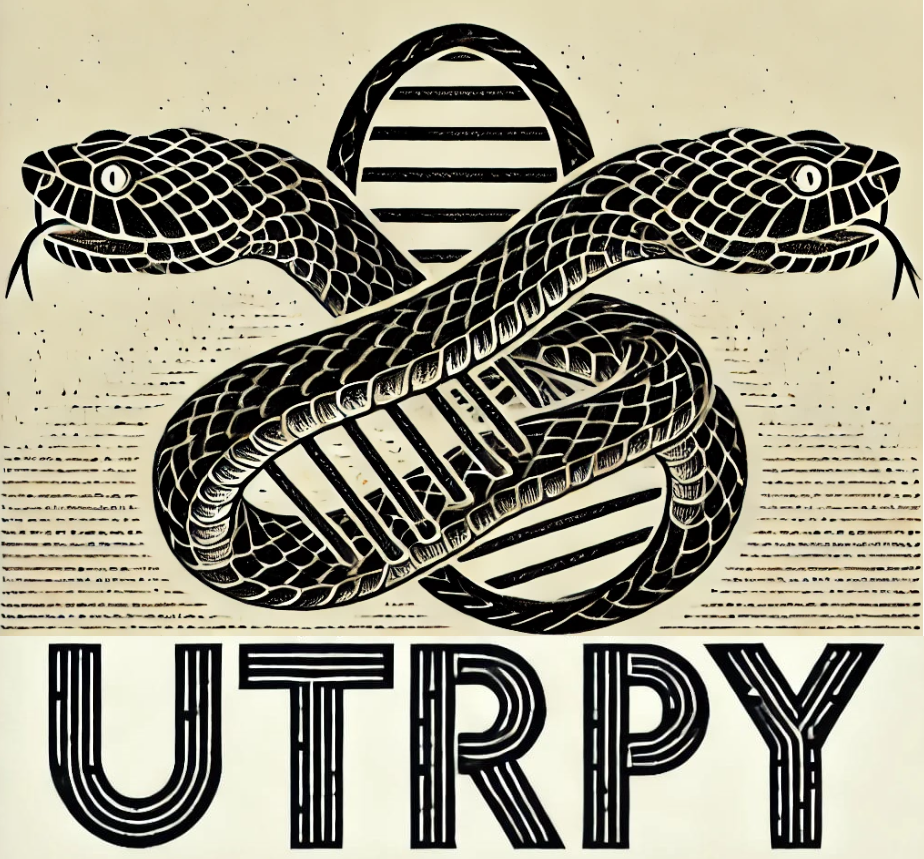

<p align="center">
  
</p>

<p align="left">
  
</p>

Lost in translation but meaningfull: UnTranslated Regions (UTRs), have a variety of<br>
important regulatory functions and a genome annotation without them wouldn't really be<br>
complete, right?

Protein ortholog-based gene prediction enables the transfer of detailed gene structure and<br>
functional annotations across species by leveraging evolutionary conservation. However,<br>
genome annotations from such methods lack UTRs. UTRpy supplements these by using exons<br>
from reference based
assemblies.

## 1 Installation

Requires Python >= 3.10

```
git clone https://github.com/SimonHegele/UTRpy
cd UTRpy
pip install .
```

## 2 Usage

```
usage: utrpy [-h] [-a ] [-k] [-m ] [-e] [-t ] gff_prediction gff_assembly gff_utrpy

UTR extension of transcript exons from protein orthology based gene prediction using exons from reference based assembly

positional arguments:
  gff_prediction      Annotation from gene prediction (GFF)
  gff_assembly        Annotation from transcriptome assembly (GFF/GTF)
  gff_utrpy           Output file

options:
  -h, --help          show this help message and exit
  -a, --ambiguities   How to chose UTR extension when there are multiple [Choices: none, smallest, longest] [Default:smallest]
  -k, --know_strand   Exons with unknown strandedness are not used
  -m, --max_ex_len    Maximum allowed exon length [Default:20000]
  -e, --explicit      Explicitly add UTRs as features
  -t, --threads       [Default:4]
```

### 2.1 Parameters

- **gff_prediction**<br>
Annotation from gene prediction (GFF)
- **gff_prediction**<br>
Annotation from transcriptome assembly (GFF/GTF)
- **gff_utrpy**<br>
Outfile to write to<br>
Annotation from gene prediction with UTR extensions (GFF)
- **-a / --ambiguities**<br>
How to deal with ambiguities:
For an exon from the gene prediction there might be multiple exons of different lengths<br>
from the transcriptome assembly that contain an UTR extension.
If so, none, the smallest or the longest can be choosen.
Default: smallest
- **-e / --explicit**<br>
Explicitly add 5'-UTRs and 3'UTRs as features to the output GFF.<br>
Requires the transcript ID to be included in the attribute values of their corresponding<br>
start and stop codons<br>
Hint: By using the dummy.gff-file you can use this feature without providing additional exons.
- **-k / --know_strand**<br>
Only use exons from the transcriptome assembly known to be on the same strand<br>
Otherwise, exons of unknown strands are allowed.
- **-m / --max_ex_len**<br>
Exons from the transcriptome assembly exceeding this length are considered to be incorrect<br>
and are not used.<br>
Default: 20000
- **-t / --threads**<br>
Chromosomes / Scaffolds can be processsed in parallel.<br> 
Default: 4

### 2.2 Output

In the output GFF, exons as well as their corresponding transcripts and genes have their<br>
start and end positions updated and their source to<br>
<source_gene_prediction> + <source_transcriptome_assembly> (UTRpy)

If run with -e / --explicit, features of type "three_prime_UTR" and "five_prime_UTR" are<br>
also added. UTR length distributions can then be explored using the jupyter-notebook<br>

In the output GFF any comments from the original GFF are removed.

**Example:**

<p align="left">
  
</p>
IGV-browser screenshot

## Identifying matching pairs of exons

The decision if in a pair of exons the exon from the transcriptome assembly (exon_ta) is<br>
an UTR-extension for the exon from the gene prediction (exon_gp) and its corresponding<br>
transcript (tran_gp) is based on the following criteria:
1. The length of exon_ta does not exceed a certain limit
2. Their strand information must match (More details in the Parameters section)
3. Exon_ta and exon_gp have either shared start or end positions
4. Exon_ta actually extends tran_gp to one side

All potential (overlapping) pairs of exons are checked for those criteria.

## 3 Limitations / Known issues

- mRNA features are ignored
- UTRpy cannot make coffee

## 4 Future plans / ideas

- Pandas -> Polars
