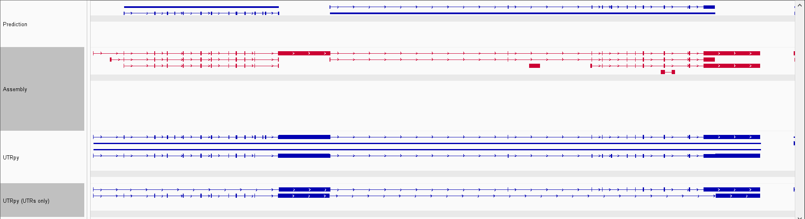

<p align="center">
  
</p>

Lost in translation but meaningfull: UnTranslated Regions (UTRs), have a variety of<br>
important regulatory functions and a genome annotation without them wouldn't really be<br>
complete, right?

Protein ortholog-based gene prediction enables the transfer of detailed gene structure and<br>
functional annotations across species by leveraging evolutionary conservation. However,<br>
genome annotations from such methods lack UTRs. UTRpy supplements these by using exons<br>
from reference-based transcriptome assemblies.

## 1 Installation

Requirements:

Python = 3.13
- Pandas
- Numpy

AGAT (https://github.com/NBISweden/AGAT)

```
conda create -n utrpy python=3.13
conda activate utrpy

mamba install -c conda-forge -c bioconda agat
git clone https://github.com/SimonHegele/UTRpy
cd UTRpy
pip install .
```

## 2 Usage

```
usage: utrpy [-h] [-m ] [-ks] [-me ] [-s ] [-k ] [-p ] [-pp ] [-tmp ] [-l ] prediction assembly outdir

UTR extension of transcript exons from protein orthology based gene prediction using exons from reference based assembly

positional arguments:
  prediction            Annotation from gene prediction (GFF/GTF)
  assembly              Annotation from transcriptome assembly (GFF/GTF)
  outdir                Output directory (Must not exist already)

options:
  -h, --help            show this help message and exit

Transcript matching:
  -m, --match           What exons of predicted transcripts to match [choices: ends, all] [default: all]
  -ks, --know_strand    Use only transcripts where the strand is known
  -me, --max_exon_length
                        Don't use assembled transcripts with exons longer than this [default: 20000]

UTR-variant selection:
  -s, --select          How to select UTR-variants if there are multiple [choices: shortest, longest, all] [default: all]
  -k, --keep            Keep the original transcript instead of deleting them

Others:
  -p, --processes       Number of parallel processes to use [Default:4]
  -pp, --pinky_promise
                        Pinky promise that prediction is correct (Will fix it otherwise)
  -tmp, --tmpdir        Temporary directory
  -l, --log_level       [default: info]
```

## 3 UTRpy workflow

1. Preprocessing with AGAT<br>
AGAT is used to fix inconsistencies in the input annotations.<br>
Most importantly transcripts are added as explicit features for the assembly.<br> 
For the prediction the preprocessing can be skipped using the -pp / --pinky_promise parameter if you are sure that your annotation is a correctly formatted GFF3-file.
2. Transcript matching<br>
Explicit representations of transcripts can be created from the annotations.
These are created for all predicted transcripts and for assembled transcripts whose genomic position includes those of predicted transcripts.<br>
The figure below shows a match between a predicted transcript (green) and an assembled one (blue)
3. UTR-variant construction<br>
For matching pairs of transcripts UTR-variants are created combining the features of both transcripts (without duplicating exons) and replace the original predicted transcript in the annotation.
Gene start and end positions are updated accordingly.
4. Postprocessing with AGAT<br>
AGAT is used to explicitly add UTRs as features to the annotation.

<p align="center">
  
</p>

## 4 Example

<p align="center">
  
</p>
Screenshot from the IGV-genome browser

## 5 Limitations / Known issues

- Gene fusions are not recognized as such and can result in overlapping duplicated genes (rare)

<p align="center">
  
</p>
Screenshot from the IGV-genome browser.

- UTRs are only explicitly annotated if start and stop codons are included in the provided annotation.

## 6 Future plans / ideas

Performance:
- Pandas -> Polars
- A "smart" way to split DataFrames

Limitations:
- Addressing gene fusion
    1. Identification of potential gene fusion
       -> Sufficient to guide manual curation.
    2. Automatically merging fused genes.
- Explicit UTR-annotation:
    Adding a feature that can extract start and stop codons from a provided reference genome 
 
